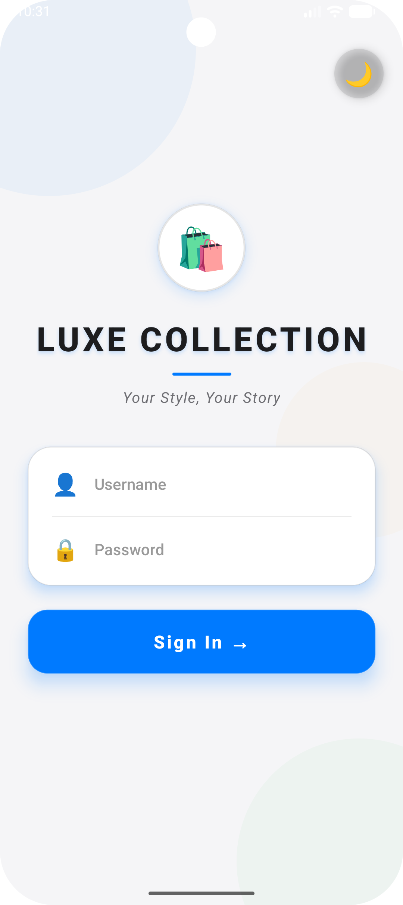
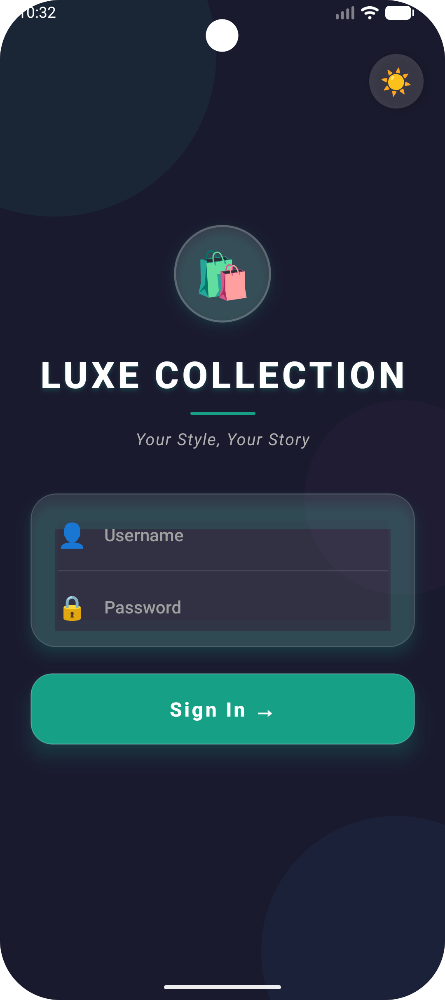
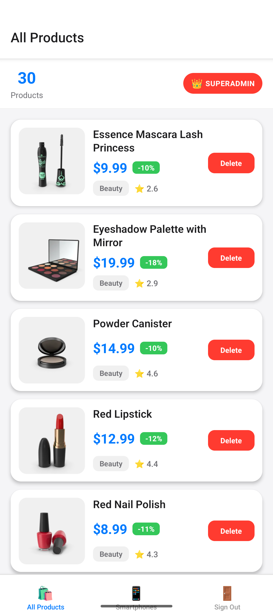
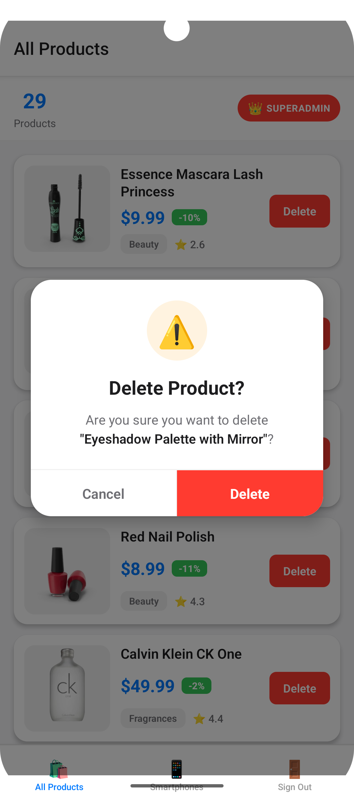
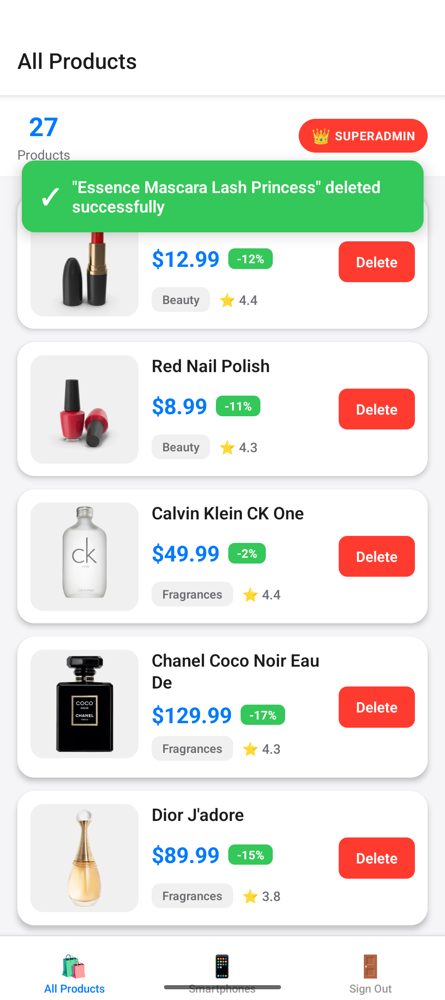
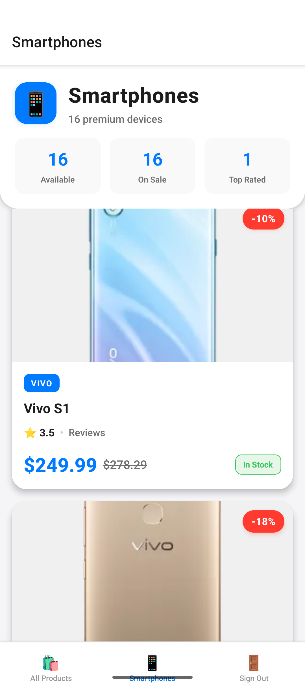

# Shopping Store - React Native App

A minimal React Native application that demonstrates authentication, product browsing, offline caching, biometric security, and auto-lock functionality using DummyJSON API.

## Features Implemented

### Core Features (100%)
- ✅ **DummyJSON Authentication** - Login with token storage and session restoration
- ✅ **3 Screens**: Login, All Products, Specific Category (Smartphones)
- ✅ **Auto-lock** - Locks after 10 seconds of inactivity and on background
- ✅ **Biometric Unlock** - Face ID/Touch ID/Fingerprint with password fallback
- ✅ **Offline Support** - MMKV-persisted React Query cache with offline indicator
- ✅ **Superadmin Mode** - Delete product functionality for designated user
- ✅ **Pull-to-Refresh** - On both product screens
- ✅ **Sign Out** - Via bottom tab navigation

### 📸 Screenshots


<p align="center">
  
  
  
</p>
<p align="center">
  
  
  
</p>

### Architecture & Technologies
- **React Native** 0.82
- **TypeScript** - Strict type safety throughout
- **React Navigation** - Native Stack + Bottom Tabs
- **React Query** - Data fetching with MMKV persistence
- **Redux Toolkit** - State management (auth + lock)
- **MMKV** - Fast, encrypted local storage
- **Axios** - HTTP client with interceptors
- **NetInfo** - Network status detection
- **Biometrics** - react-native-biometrics

## Setup Instructions

### Prerequisites
- Node.js >= 20
- React Native development environment set up
- Android Studio (for Android) or Xcode (for iOS)
- Physical device or emulator

### Installation

1. **Clone and install dependencies:**
```bash
cd HelloApp
npm install
```

2. **For Android:**
```bash
# Start Metro bundler
npm start

# In another terminal, run on Android
npx react-native run-android
```

3. **For iOS (macOS only):**
```bash
cd ios && pod install && cd ..
npm start

# In another terminal
npx react-native run-ios
```

## Usage

### Test Credentials
**Superadmin User:**
- Username: `emilys`
- Password: `emilyspass`

**Regular User (for testing):**
- Username: `michaelw`
- Password: `michaelwpass`

### Features to Test

#### 1. Login & Authentication
1. Launch the app
2. Enter credentials (use `emilys` / `emilyspass`)
3. Click "Sign In"
4. You should be authenticated and see the All Products screen

#### 2. All Products Screen
- View list of all products with thumbnails
- If logged in as `emilys`, see "SUPERADMIN MODE" banner
- Click "Delete" button on any product (simulated delete - removes from UI)
- Pull down to refresh the list
- Deleted products reappear (API simulation)

#### 3. Smartphones Category Screen
- Tap the "Smartphones" tab
- View only smartphone products
- Pull to refresh works here too

#### 4. Auto-Lock (10 seconds)
- After login, wait 10 seconds without interacting
- App automatically locks and shows biometric unlock screen
- Use fingerprint/face ID to unlock
- Or tap "Use Password Instead" for password fallback

#### 5. Background Lock
- Put the app in background (press home button)
- Return to the app
- App should be locked and require biometric/password unlock

#### 6. Offline Mode
- Login and browse products
- Turn off WiFi/mobile data
- Orange "Offline - Showing cached data" banner appears
- Products still load from MMKV cache
- Pull-to-refresh won't fetch new data (offline)

#### 7. Session Restoration
- Login to the app
- Close the app completely
- Reopen the app
- Biometric unlock screen appears (session restored from storage)
- Unlock to continue

#### 8. Sign Out
- Tap the "Sign Out" tab
- Confirm sign out
- Returned to login screen
- Session cleared from storage

## Project Structure

```
HelloApp/
├── src/
│   ├── components/
│   │   ├── ActivityTracker.tsx      # Tracks user activity for auto-lock
│   │   ├── LockOverlay.tsx          # Lock screen modal overlay
│   │   └── OfflineIndicator.tsx     # Network status banner
│   ├── config/
│   │   └── queryClient.ts           # React Query with MMKV persistence
│   ├── hooks/
│   │   ├── useAutoLock.ts           # Auto-lock logic (10s + background)
│   │   ├── useNetworkStatus.ts      # Network status detection
│   │   └── useRedux.ts              # Typed Redux hooks
│   ├── navigation/
│   │   └── AppNavigator.tsx         # Navigation setup
│   ├── screens/
│   │   ├── AllProductsScreen.tsx    # Products list + delete
│   │   ├── BiometricUnlockScreen.tsx # Biometric/password unlock
│   │   ├── LoginScreen.tsx          # Authentication
│   │   └── SpecificCategoryScreen.tsx # Smartphones category
│   ├── services/
│   │   ├── api.ts                   # DummyJSON API client
│   │   └── biometricService.ts      # Biometric authentication
│   ├── store/
│   │   ├── slices/
│   │   │   ├── authSlice.ts         # Auth state management
│   │   │   └── lockSlice.ts         # Lock state management
│   │   └── index.ts                 # Redux store
│   ├── types/
│   │   └── index.ts                 # TypeScript type definitions
│   └── utils/
│       └── storage.ts               # MMKV storage wrapper
├── App.tsx                          # Root component
└── package.json
```

## Configuration

### Chosen Category
The specific category screen displays: **smartphones**

### Superadmin User
Username: **emilys**

Only this user sees the "Delete" button on products.

### Auto-Lock Timeout
Configured in `src/hooks/useAutoLock.ts`:
```typescript
const INACTIVITY_TIMEOUT = 10000; // 10 seconds
```

## API Endpoints Used

All endpoints from https://dummyjson.com:

- `POST /auth/login` - User authentication
- `GET /auth/me` - Current user validation
- `GET /products` - All products list
- `GET /products/categories` - Available categories
- `GET /products/category/smartphones` - Smartphones only
- `DELETE /products/:id` - Delete product (simulated)

## Acceptance Checklist

- ✅ Login authenticates; token stored/applied; session restored
- ✅ Biometric shown on relaunch if token exists
- ✅ App auto-locks after 10s of inactivity
- ✅ App locks when going to background
- ✅ Lock overlay obscures content
- ✅ Biometric unlock works with password fallback
- ✅ All Products renders list with pull-to-refresh
- ✅ Offline banner when disconnected
- ✅ Specific Category renders filtered list (smartphones)
- ✅ Superadmin can delete product (UI updates, simulated)
- ✅ React Query cache persists to MMKV
- ✅ Cached lists render instantly on cold start
- ✅ Content available offline after viewing online

## Troubleshooting

### Metro Bundler Issues
```bash
npm start -- --reset-cache
```

### Android Build Issues
```bash
cd android && ./gradlew clean && cd ..
npx react-native run-android
```

### Clear All Data
```bash
# Uninstall and reinstall
adb uninstall com.helloapp
npx react-native run-android
```

## Credits

- **API**: DummyJSON (https://dummyjson.com)
- **Developer**: Built as a coding challenge
- **Date**: 2025

---

**Note**: This is a demo application for a coding challenge. In a production environment, additional security measures, error handling, and testing would be implemented.
